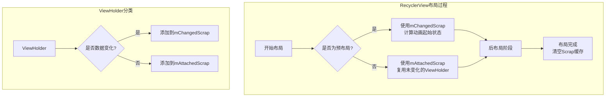
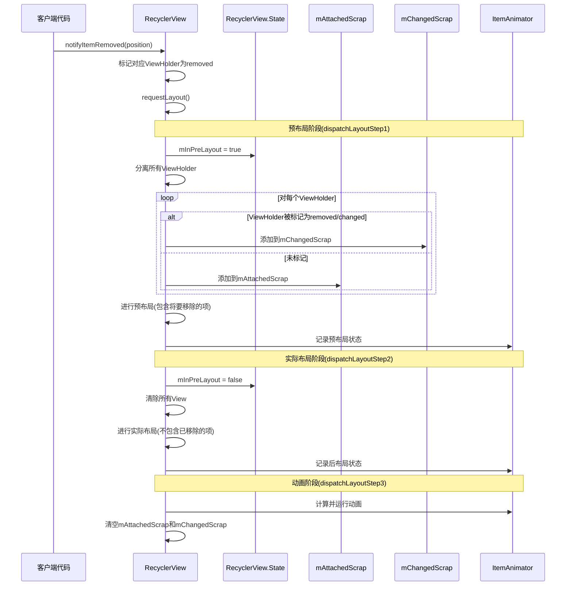

# RecyclerView的四级缓存结构 - 第一级缓存

## 第一级缓存：mAttachedScrap和mChangedScrap

### 特点与区别

- **mAttachedScrap**：
  - 存储仍然依附在RecyclerView上但已被标记为分离的ViewHolder
  - 存储的是**没有发生数据变化**的ViewHolder
  - 布局完成后可以直接复用，无需重新绑定数据
  - 通常用于布局阶段的快速重定位

- **mChangedScrap**：
  - 存储数据已变化的ViewHolder
  - 存储的ViewHolder已经**标记为changed或removed**
  - 主要用于动画过渡期间的预布局(pre-layout)阶段
  - 配合ItemAnimator实现平滑的动画效果

### 使用场景与工作原理

当RecyclerView需要重新布局（如notifyDataSetChanged、添加/删除item等操作）时：

1. **布局准备阶段**：
   - 将所有当前屏幕上的ViewHolder临时detach
   - 根据ViewHolder的状态将其分配到mAttachedScrap或mChangedScrap

2. **布局执行阶段**：
   - 优先从mAttachedScrap/mChangedScrap中查找并复用对应位置的ViewHolder
   - 布局完成后这两个缓存就会被清空

3. **预布局与后布局**：
   - 在预布局阶段，mChangedScrap中的ViewHolder用于计算动画的起始状态
   - 在后布局阶段，这些ViewHolder会被重新布局到新的位置

### 示意图说明

### 预布局与后布局阶段的ViewHolder状态变化图

下图展示了mAttachedScrap和mChangedScrap在布局过程中的角色：

 

### 图表中箭头的含义解释

图表中的各个箭头描述了ViewHolder在布局过程中的流动方向和处理方式：

1. **临时分离**：从预布局阶段到过渡阶段的箭头，表示所有视图被临时从RecyclerView中分离出来。

2. **存入未变化视图**：从预布局阶段的普通Items指向mAttachedScrap的箭头，表示那些未发生变化的ViewHolder会被存入mAttachedScrap缓存。

3. **存入已改变视图**：从预布局阶段的已改变Item指向mChangedScrap的箭头，表示被标记为changed或removed的ViewHolder会被存入mChangedScrap缓存。

4. **复用未变化视图**：从mAttachedScrap指向后布局阶段的箭头，表示在后布局阶段，RecyclerView会从mAttachedScrap中取出ViewHolder并直接复用，无需重新绑定数据。

5. **复用已改变视图**：从mChangedScrap指向后布局阶段的箭头，这个箭头表示RecyclerView会尝试复用那些内容或状态已经改变的ViewHolder。具体来说：
   - 在预布局阶段，像Item 3这样的已变化视图被存入mChangedScrap
   - 在后布局阶段，即使这些Item可能已被删除（如图中的"Item 3已移除"），RecyclerView仍会先从mChangedScrap中取出它们
   - 系统会使用这些ViewHolder来计算从存在到消失（或其他变化）的动画效果
   - 这就是为什么即使Item被删除了，RecyclerView也能显示平滑的消失动画，而不是直接从屏幕上消失

6. **重新布局**：从过渡阶段到后布局阶段的箭头，表示RecyclerView执行实际的布局过程，将视图放置到它们最终的位置。

通过这种缓存和复用机制，RecyclerView能够在视图状态发生变化时实现高效的布局更新和平滑的动画效果。 