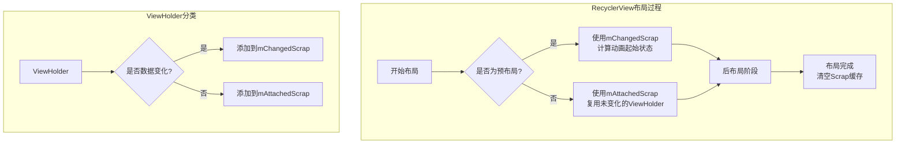
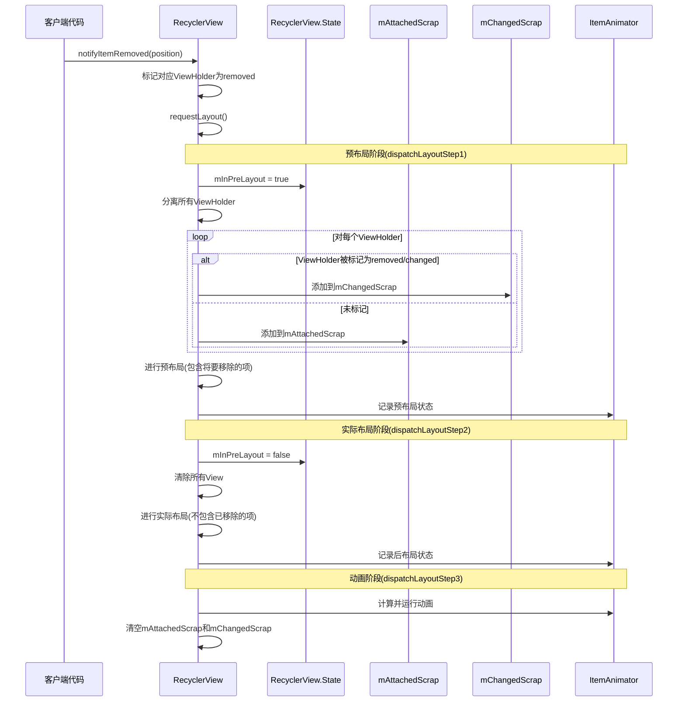

# RecyclerView的四级缓存结构 - 第一级缓存

## 第一级缓存：mAttachedScrap和mChangedScrap

### "Scrap"含义解释

在RecyclerView的上下文中，"scrap"（直译为"废料"或"碎片"）指的是那些暂时从屏幕上分离(detach)但很快会被重新使用的ViewHolder。与真正的"废料"不同，这些ViewHolder并非被丢弃，而是被临时存储起来，在布局过程完成后立即重新使用。这种命名反映了它们的临时性质和快速周转的特点。

Scrap缓存是RecyclerView缓存体系中生命周期最短的一级，专门用于处理布局过程中的视图重用，而不需要经过绑定数据等耗时操作。

### 特点与区别

- **mAttachedScrap**：
  - 存储仍然依附在RecyclerView上但已被标记为分离的ViewHolder
  - 存储的是**没有发生数据变化**的ViewHolder
  - 布局完成后可以直接复用，无需重新绑定数据
  - 通常用于布局阶段的快速重定位

- **mChangedScrap**：
  - 存储数据已变化的ViewHolder
  - 存储的ViewHolder已经**标记为changed或removed**
  - 主要用于动画过渡期间的预布局(pre-layout)阶段
  - 配合ItemAnimator实现平滑的动画效果

### 使用场景与工作原理

当RecyclerView需要重新布局（如notifyDataSetChanged、添加/删除item等操作）时：

1. **布局准备阶段**：
   - 将所有当前屏幕上的ViewHolder临时detach
   - 根据ViewHolder的状态将其分配到mAttachedScrap或mChangedScrap

2. **布局执行阶段**：
   - 优先从mAttachedScrap/mChangedScrap中查找并复用对应位置的ViewHolder
   - 布局完成后这两个缓存就会被清空

3. **预布局与后布局**：
   - 在预布局阶段，mChangedScrap中的ViewHolder用于计算动画的起始状态
   - 在后布局阶段，这些ViewHolder会被重新布局到新的位置

### 示意图说明

### 预布局与后布局阶段的ViewHolder状态变化图

下图展示了mAttachedScrap和mChangedScrap在布局过程中的角色：

 

### 图表中箭头的含义解释

图表中的各个箭头描述了ViewHolder在布局过程中的流动方向和处理方式：

1. **临时分离**：从预布局阶段到过渡阶段的箭头，表示所有视图被临时从RecyclerView中分离出来。

2. **存入未变化视图**：从预布局阶段的普通Items指向mAttachedScrap的箭头，表示那些未发生变化的ViewHolder会被存入mAttachedScrap缓存。

3. **存入已改变视图**：从预布局阶段的已改变Item指向mChangedScrap的箭头，表示被标记为changed或removed的ViewHolder会被存入mChangedScrap缓存。

4. **复用未变化视图**：从mAttachedScrap指向后布局阶段的箭头，表示在后布局阶段，RecyclerView会从mAttachedScrap中取出ViewHolder并直接复用，无需重新绑定数据。

5. **复用已改变视图**：从mChangedScrap指向后布局阶段的箭头，这个箭头表示RecyclerView会尝试复用那些内容或状态已经改变的ViewHolder。具体来说：
   - 在预布局阶段，像Item 3这样的已变化视图被存入mChangedScrap
   - 在后布局阶段，即使这些Item可能已被删除（如图中的"Item 3已移除"），RecyclerView仍会先从mChangedScrap中取出它们
   - 系统会使用这些ViewHolder来计算从存在到消失（或其他变化）的动画效果
   - 这就是为什么即使Item被删除了，RecyclerView也能显示平滑的消失动画，而不是直接从屏幕上消失

6. **重新布局**：从过渡阶段到后布局阶段的箭头，表示RecyclerView执行实际的布局过程，将视图放置到它们最终的位置。

通过这种缓存和复用机制，RecyclerView能够在视图状态发生变化时实现高效的布局更新和平滑的动画效果。 

### RecyclerView布局阶段详解

RecyclerView的布局过程被分为三个主要步骤，每个步骤都有特定的职责和作用。理解这些阶段对深入掌握RecyclerView的缓存机制至关重要：

#### 1. 预布局阶段 (Pre-layout Phase，dispatchLayoutStep1)

预布局阶段是RecyclerView动画系统的关键部分，主要职责包括：

- **记录变化前的视图状态**：在数据变更后但实际布局变化前，记录所有视图的初始位置和状态
- **处理即将消失的视图**：将被标记为removed的视图纳入布局计算，使它们保持在原来的位置
- **准备动画初始状态**：为ItemAnimator提供动画开始前的视图状态信息

这一阶段的特点是：
- 所有视图（包括即将消失的）都会参与布局计算
- 通过设置`mInPreLayout = true`标识当前处于预布局状态
- ViewHolder被临时分离并分类到不同的缓存池（mAttachedScrap/mChangedScrap）

#### 2. 实际布局阶段 (Post-layout Phase，dispatchLayoutStep2)

实际布局阶段是RecyclerView完成真实布局的阶段，主要职责包括：

- **执行真实布局**：根据当前数据集的实际状态进行布局
- **移除已删除项**：不再考虑已删除的项目
- **应用数据变化**：根据最新数据重新排列和显示视图
- **记录最终状态**：为动画系统记录视图的最终位置和状态

这一阶段的特点是：
- 设置`mInPreLayout = false`表示当前是实际布局状态
- 布局计算只考虑实际存在的数据项
- 从缓存中获取ViewHolder进行复用，优先考虑Scrap缓存

#### 3. 动画执行阶段 (Animation Phase，dispatchLayoutStep3)

动画执行阶段是处理视图过渡效果的阶段，主要职责包括：

- **计算视图变化**：对比预布局和实际布局的差异
- **创建并执行动画**：根据差异创建添加、移除、移动或变化的动画
- **清理缓存**：完成布局后清空临时缓存（如mAttachedScrap和mChangedScrap）

这一阶段的特点是：
- 利用前两个阶段收集的信息计算视图位置的变化
- 通过ItemAnimator执行平滑的过渡动画
- 完成所有RecyclerView的布局操作

#### 布局步骤间的数据流动

在整个布局过程中，Scrap缓存作为临时存储机制，在各阶段间传递ViewHolder：

1. **dispatchLayoutStep1**：将当前视图分离并存入Scrap缓存
2. **dispatchLayoutStep2**：从Scrap缓存中获取ViewHolder进行布局
3. **dispatchLayoutStep3**：清空Scrap缓存，完成布局流程

这三个步骤的紧密配合是RecyclerView能够实现高效视图复用和平滑动画效果的核心机制。 