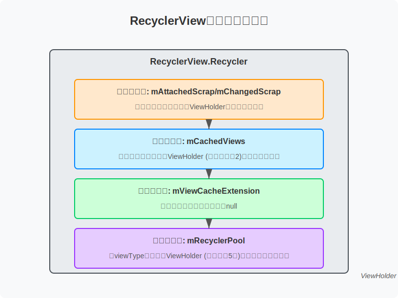

# RecyclerView的四级缓存结构 - 缓存结构概览

RecyclerView之所以能高效地展示大量数据，关键在于其精心设计的多级缓存结构。本部分将介绍RecyclerView缓存结构的概览。

## 缓存结构概览

RecyclerView的缓存体系由四个层次组成，按照优先级从高到低依次为：

1. **mAttachedScrap和mChangedScrap**：临时缓存屏幕上可见的ViewHolder，用于布局过程中的临时detach和复用
2. **mCachedViews**：一级缓存，默认大小为2，存储最近被移出屏幕的ViewHolder
3. **mViewCacheExtension**：二级缓存，开发者自定义的缓存逻辑
4. **mRecyclerPool**：三级缓存，回收池，按照viewType分组存储ViewHolder

这四级缓存各有特点，相互配合，共同提高了RecyclerView的性能和响应速度。

### 缓存结构类图

```mermaid
classDiagram
    class RecyclerView {
        -Recycler mRecycler
        +setItemViewCacheSize(int size)
        +setRecycledViewPool(RecycledViewPool pool)
        +setViewCacheExtension(ViewCacheExtension extension)
    }

    class Recycler {
        -ArrayList~ViewHolder~ mAttachedScrap
        -ArrayList~ViewHolder~ mChangedScrap
        -ArrayList~ViewHolder~ mCachedViews
        -ViewCacheExtension mViewCacheExtension
        -RecycledViewPool mRecyclerPool
        -int mViewCacheMax
        +getViewForPosition(int position)
        +recycleView(View view)
        -tryGetViewHolderForPositionByDeadline()
    }

    class ViewCacheExtension {
        <<abstract>>
        +getViewForPositionAndType()*
    }

    class RecycledViewPool {
        -SparseArray~ScrapData~ mScrap
        +setMaxRecycledViews(int viewType, int max)
        +getRecycledView(int viewType)
        +putRecycledView(ViewHolder scrap)
        -ScrapData getScrapDataForType(int viewType)
    }

    class ScrapData {
        -ArrayList~ViewHolder~ mScrapHeap
        -int mMaxScrap
    }

    class ViewHolder {
        -int mPosition
        -int mItemViewType
        -boolean mInvalid
        -boolean mChanged
        -boolean mRecyclable
    }

    RecyclerView --> Recycler : 包含
    Recycler --> ViewCacheExtension : 引用
    Recycler --> RecycledViewPool : 引用
    RecycledViewPool --> ScrapData : 包含
    Recycler --> "many" ViewHolder : 管理
    ScrapData --> "many" ViewHolder : 存储
```

### 滚动场景下的缓存处理流程图

```mermaid
flowchart TD
    Start[用户滚动RecyclerView] --> A[检测滚出屏幕的ViewHolder]
    A --> B[调用recycleViewHolderInternal]
    
    B --> C{ViewHolder是否有效?}
    C -->|否| D[直接丢弃]
    C -->|是| E{mCachedViews是否已满?}
    
    E -->|否| F[添加到mCachedViews]
    E -->|是| G[从mCachedViews移除最老的ViewHolder]
    G --> H[将移除的ViewHolder添加到mRecyclerPool]
    H --> F
    
    Start --> I[检测需要新显示的位置]
    I --> J[调用getViewForPosition]
    J --> K[调用tryGetViewHolderForPositionByDeadline]
    
    K --> L{从mAttachedScrap查找}
    L -->|找到| M[直接复用]
    L -->|未找到| N{从mChangedScrap查找}
    
    N -->|找到| M
    N -->|未找到| O{从mCachedViews查找}
    
    O -->|找到| M
    O -->|未找到| P{从mViewCacheExtension查找}
    
    P -->|找到| Q[可能需要重新绑定]
    P -->|未找到| R{从mRecyclerPool查找}
    
    R -->|找到| S[需要重新绑定]
    R -->|未找到| T[创建新ViewHolder]
    
    Q --> End[返回ViewHolder]
    S --> End
    T --> End
    M --> End

    class Start,End fill:#f9f,stroke:#333,stroke-width:2px
    class L,N,O,P,R fill:#bbf,stroke:#33f,stroke-width:1px
    class M,Q,S,T fill:#bfb,stroke:#3b3,stroke-width:1px
```

在后续章节中，我们将详细分析每一级缓存的特点、使用场景和实现原理。 