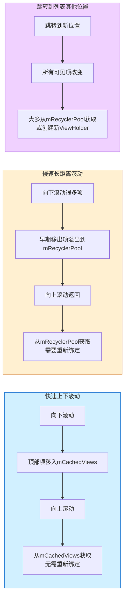

# RecyclerView的四级缓存结构 - 第二级缓存

## 第二级缓存：mCachedViews

### 特点

- 存储最近滚出屏幕的ViewHolder
- 默认大小为2，可以通过`setItemViewCacheSize()`方法修改
- 按照position索引，可以直接复用而无需重新绑定数据
- 遵循FIFO（先进先出）原则

### 使用场景

这一级缓存主要用于快速的来回滚动场景：

- 当用户向下滚动，顶部的ViewHolder被回收到mCachedViews
- 当用户向上滚动回到顶部，直接从mCachedViews获取之前的ViewHolder
- 无需重新绑定数据，提高滚动性能

### 不同滚动场景下的缓存利用图

