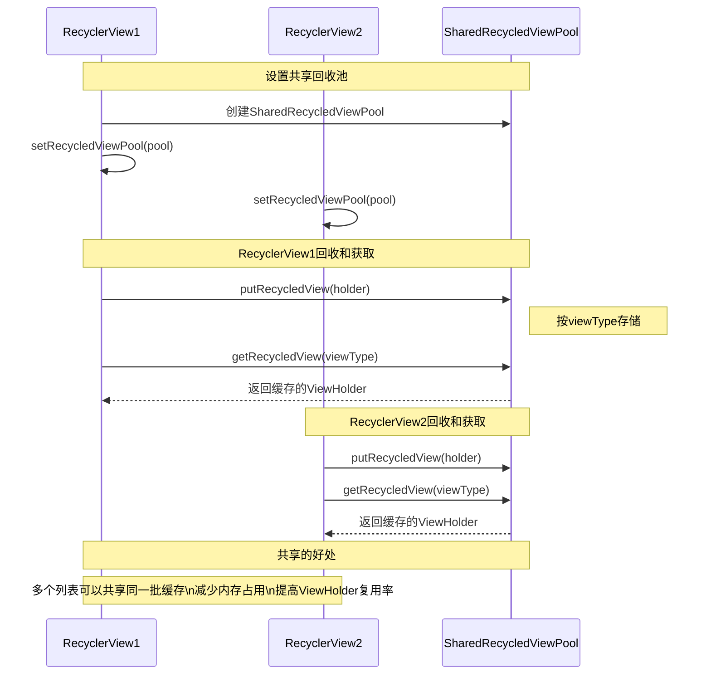
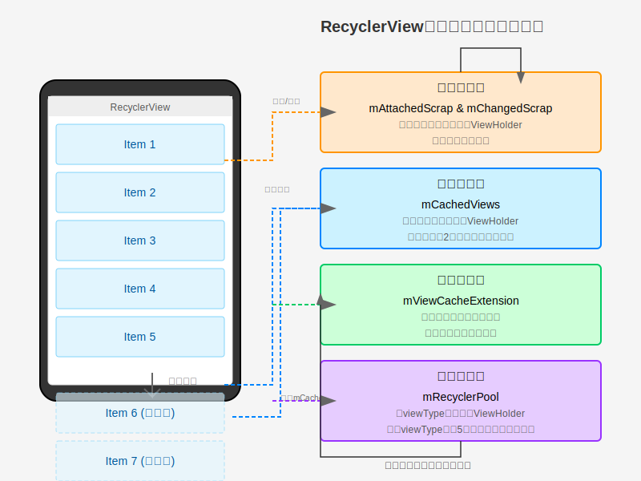

# RecyclerView的四级缓存结构 - 第四级缓存

## 第四级缓存：mRecyclerPool

### 特点

- 按照viewType分组存储ViewHolder
- 每个viewType默认缓存5个ViewHolder，可通过`setMaxRecycledViews()`调整
- 从回收池取出的ViewHolder需要重新绑定数据
- 可以在多个RecyclerView之间共享

### 使用场景

适用于大量数据的列表，以及多个RecyclerView共享缓存的场景：

- 普通的长列表滚动，当mCachedViews已满
- 多个列表使用相同布局的ViewHolder，可共享缓存提高效率
- 列表数据变化较大，需要重新绑定数据的场景

### 多个RecyclerView共享回收池的工作流程

## 手机屏幕与四级缓存的关系

下图直观展示了RecyclerView中显示的Item与四级缓存之间的关系：

如上图所示，当用户滚动RecyclerView时：

1. 屏幕上的ViewHolder先被临时存储在第一级缓存（mAttachedScrap和mChangedScrap）中
2. 当Item滚出屏幕时，其ViewHolder会被存入第二级缓存（mCachedViews）
3. 如果需要更多缓存，可以通过自定义的第三级缓存（mViewCacheExtension）实现
4. 最后，第四级缓存（mRecyclerPool）存储不同类型的ViewHolder，供需要时使用

各级缓存协同工作，确保了RecyclerView的高效滚动和显示。 